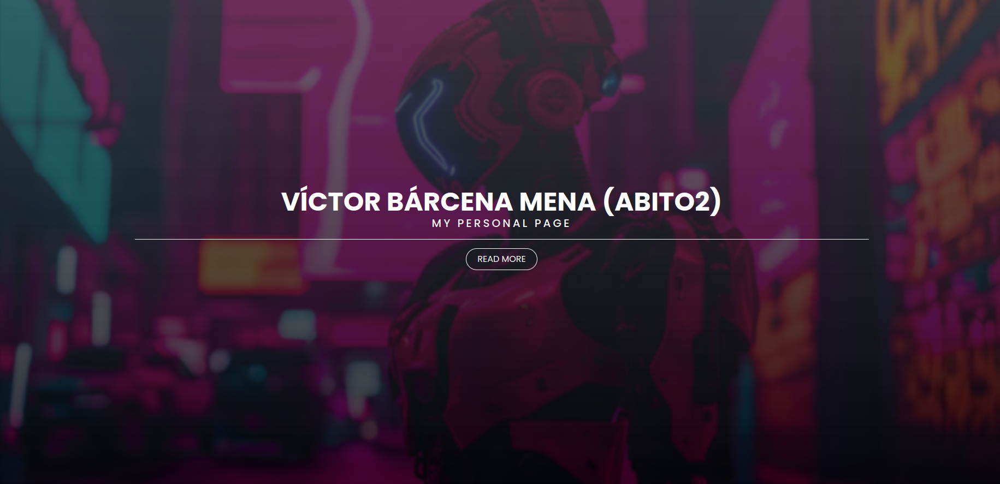

# My personal page
Implemented **WhatATheme** a customizable Jekyll Portfolio theme which supports blogging, to create my personal page.

# Features :sparkles:
* Free and Easy setup
* No Coding Required
* Compatible with [Github Pages](https://pages.github.com/)
* Responsive and Blogging Ready
* HTML Compressor using [Jekyll Compress HTML](https://jch.penibelst.de/)
* Minified CSS using SaSS
* CMS Admin Support using [Jekyll Admin](https://jekyll.github.io/jekyll-admin/)
* Supports Latest [Jekyll 4.x](https://jekyllrb.com/) and [Bundler](https://bundler.io/)
* Stylesheet built using SaSS
* Comments using Disqus
* Analytics using Google Analytics
* Instant Search using [Simple Jekyll Search](https://github.com/christian-fei/Simple-Jekyll-Search/)
---

### Credits :bulb:
* [Sneha Omer](http://sassyecoder.github.io/)
* [Harsh Trivedi](http://harsh98trivedi.github.io/)

### License
The contents of this repository are licensed under the [**GNU General Public License v2.0**](https://github.com/thedevslot/WhatATheme/blob/master/LICENSE)
